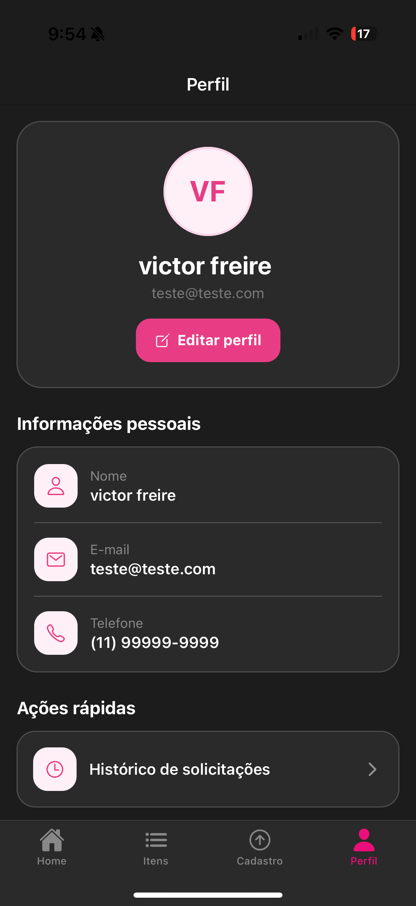
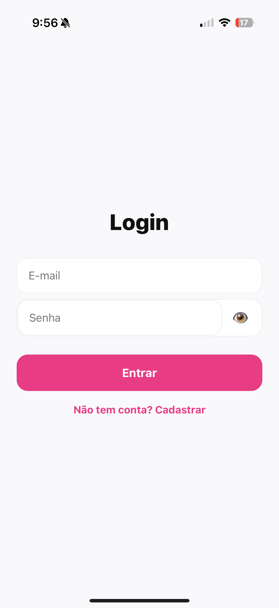
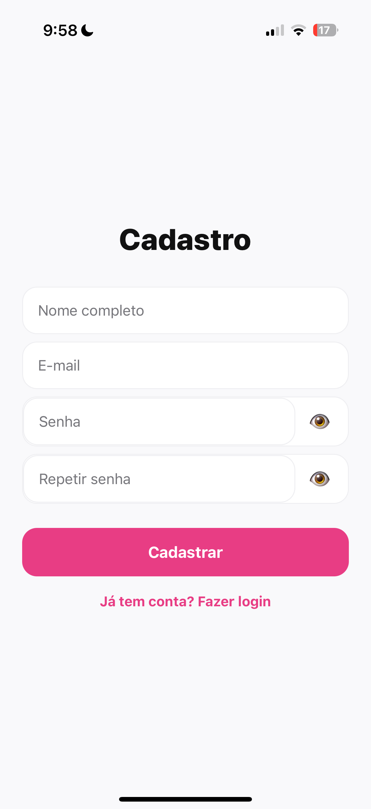

# 📱 Achados e Perdidos - Faculdade

Aplicativo mobile desenvolvido em React Native com o objetivo de facilitar o registro e a busca de itens perdidos dentro do ambiente acadêmico.  

Enrico Ricarte Rodrigues - RM558571  
Pedro Gaspar Fernandes Ferrari – RM554887  
Victor Freire Martins Siqueira – RM556191  

---

## 🚀 Sobre o Projeto

O **Achados e Perdidos** é um app que conecta pessoas que perderam objetos com aquelas que os encontraram dentro da faculdade.

A proposta é simples:
- Encontrou algo? Cadastre no app.
- Perdeu algo? Procure na lista de itens.

---

## 🧩 Funcionalidades

- 🏠 **Home**
  - Tela inicial com navegação principal do app

- 📦 **Itens**
  - Visualização de itens perdidos/encontrados
  - Lista com informações dos objetos

- 👤 **Perfil**
  - Informações do usuário

- 📝 **Cadastro**
  - Registro de novos itens perdidos no sistema

---

## 🔐 Novas Funcionalidades

Nesta versão, o app foi aprimorado com autenticação, persistência de dados e melhorias de usabilidade.

### 👥 Autenticação
- Cadastro com:
  - Nome, e-mail válido, senha (mín. 6 caracteres) e confirmação  
- Login com validação de credenciais  
- Sessão persistida (usuário continua logado ao reabrir o app)  
- Logout com limpeza de sessão  
- Redirecionamento automático após login  

### 💾 Persistência de Dados
- Uso de **AsyncStorage** para armazenar:
  - Dados do usuário  
  - Itens cadastrados  
- Dados permanecem mesmo após fechar o app  
- Atualização automática ao adicionar, editar ou remover dados  

### 🌐 Estado Global (Context API)
- Gerenciamento centralizado com:
  - **AuthContext** (login, logout, usuário)  
  - Contexto de dados do app  
- Proteção de rotas (usuário não autenticado não acessa o sistema)  

### ✅ Validação de Formulários
- Validação em todos os formulários:
  - Campos obrigatórios  
  - E-mail válido  
  - Senha mínima de 6 caracteres  
  - Confirmação de senha  
- Mensagens de erro exibidas abaixo dos campos  
- Botão desabilitado em caso de erro  

### 🎨 UI/UX
- Melhorias visuais em todas as telas  
- Navegação mais fluida  
- Interface mais intuitiva  

---

## 🛠️ Tecnologias Utilizadas

- React Native  
- Expo  
- JavaScript  
- Expo Router  
- AsyncStorage  
- Context API  

---

## 📱 Como executar o projeto

### Pré-requisitos:
- Node.js instalado
- Expo CLI
- Android Studio (ou celular com Expo Go)

---

### 🔧 Instalação

```bash
# Clonar o repositório
git clone https://github.com/BitWise-FIAP/fiap-mdi-cp1-achados-e-perdidos

# Entrar na pasta
cd fiap-mdi-cp1-achados-e-perdidos

# Instalar dependências
npm install
```

▶️ Executar

```
npx expo start
```

📸 Screenshots e Gif

### Gif - Sistema 


### Nova Funcionalidade - Modo Escuro e Telas de Login e Cadastro de Conta
<p align="center">
  
  
  
  
</p>


### 🏠 Home


### 📦 Itens


### 👤 Perfil


### 📝 Cadastro

